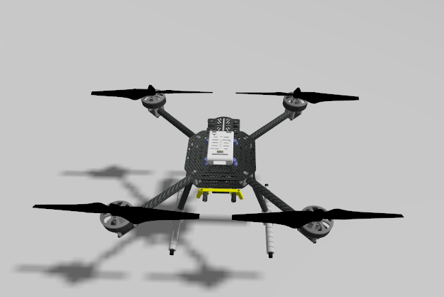
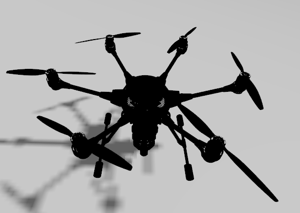

# steps to use
OS: Ubuntu

1. Get Gazebo garden. follow their [installation](https://gazebosim.org/docs/garden/install_ubuntu)
2. Get px4. Follow their [installation guide](https://docs.px4.io/main/en/sim_gazebo_gz/). 
3. verify that px4 works by running one of the examples.

4. Clone the repo.
5. navigate to the root dir of the repo and `source setup.bash`

### For Quadcopter x500

6. test the x500 quadcopter `gz sim x500_empty_world.sdf -v`
7. test the motors with `gz topic -t /x500/command/motor_speed -m gz.msgs.Actuators -p 'velocity:[10,10,10,10]'`. They should start spinning. 
8. now shutdown the motors 0 and 2 with `gz topic -t /x500/shutdown -m gz.msgs.Int32_V -p 'data:[0,2]'`. the two motors will stop working.

    To re-enable them run the same command again.
9. copy the airframe_config file called `4101_gz_x500` in dir [airframe_config](./airframe_config/4101_gz_x500). paste it in `<path>/PX4-Autopilot/build/px4_sitl_default/etc/init.d-posix/airframes`.
10. Now run `gz sim x500_empty_world.sdf -v`. Navigate to `<path>/PX4-Autopilot`. Run `PX4_SYS_AUTOSTART=4101 ./build/px4_sitl_default/bin/px4`. 
11. type `commander takeoff` and `commander land` to verify it works.
12. After running `commander takeoff` in the px4 prompt. Use `gz topic -t /x500/shutdown -m gz.msgs.Int32_V -p 'data:[0]'` to stop motor 0. OR whichever motor/s you want.

### For Hexacopter typhoon_h480

6. test the x500 quadcopter `gz sim typhoon_empty_world.sdf -v`
7. test the motors with `gz topic -t /typhoon_h480/command/motor_speed -m gz.msgs.Actuators -p 'velocity:[10,10,10,10,10,10]'`. They should start spinning. 
8. now shutdown the motors 0 and 2 with `gz topic -t /typhoon_h480/shutdown -m gz.msgs.Int32_V -p 'data:[0,2]'`. the two motors will stop working.

    To re-enable them run the same command again.
9. copy the airframe_config file called `6101_gz_typhoon` in dir [airframe_config](./airframe_config/6101_gz_typhoon). paste it in `<path>/PX4-Autopilot/build/px4_sitl_default/etc/init.d-posix/airframes`.
10. Now run `gz sim typhoon_empty_world.sdf -v`. Navigate to `<path>/PX4-Autopilot`. Run `PX4_SYS_AUTOSTART=6101 ./build/px4_sitl_default/bin/px4`. 
11. type `commander takeoff` and `commander land` to verify it works.
12. After running `commander takeoff` in the px4 prompt. Use `gz topic -t /typhoon_480/shutdown -m gz.msgs.Int32_V -p 'data:[0]'` to stop motor 0. OR whichever motor/s you want.